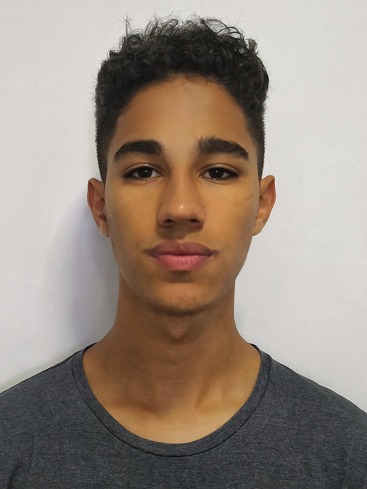

# PORTIFÓLIO

<br>

<p align="center">

</p>

<br>

## Tecnologias Utilizadas no Projeto

- Python 3.11.5
- Flask 2.3.3

<br>

## Autor

- Nome: Juan Garcia Soares
- Email: juan.garcia.soares@gmail.com
- GitHub: [Seu perfil GitHub](https://github.com/ojuansoares)

<br>

## Como Clonar e Executar o Projeto

Siga as instruções abaixo para clonar e executar o projeto em sua máquina local.

<br>

### Pré-requisitos

Certifique-se de ter o Python 3.11.5 e Flask 2.3.3 (ou versões superiores) instalados em sua máquina.

<br>

### Passos

1. No GitHub.com, navegue até a página principal do repositório.

2. Acima da lista de arquivos, clique em <> Código.

3. Copie a URL do repositório.

4. Abra Git Bash.

5. Altere o diretório de trabalho atual para o local em que deseja ter o diretório clonado.

6. Digite git clone e cole a URL já copiada.

   ```bash
   git clone https://github.com/ojuansoares/portifolio_digital_dsm

7. Pressione ENTER para criar seu clone local.
