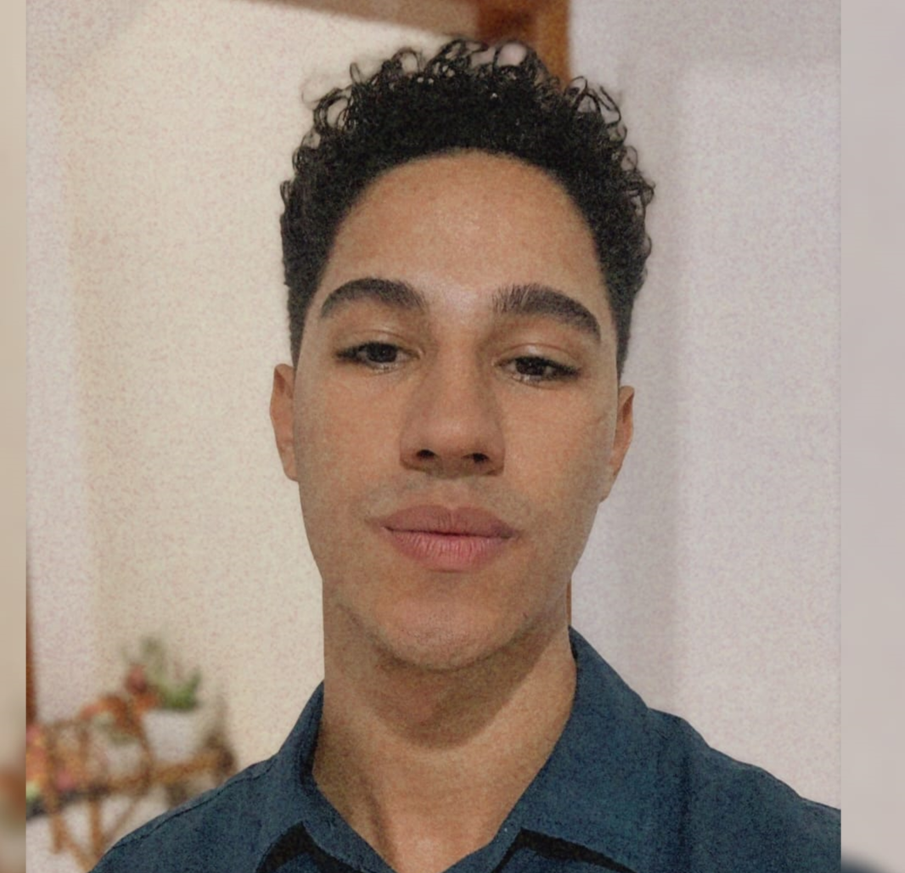

# PORTFÓLIO

<br>

<p align="center">

</p>

<br>

## Tecnologias Utilizadas no Projeto

- Python 3.11.5
- Flask 3.0.0

<br>

## Acesse o Projeto [Clicando aqui!](https://portfolio-juansoares.vercel.app/)

<br>

## Autor

- Nome: Juan Garcia Soares
- Email: juan.garcia.soares@gmail.com
- GitHub: [Seu perfil GitHub](https://github.com/ojuansoares)

<br>

## Como Clonar e Executar o Projeto

Siga as instruções abaixo para clonar e executar o projeto em sua máquina local.

<br>

### Pré-requisitos

Certifique-se de ter o Python 3.11.5 e Flask 3.0.0 (ou versões superiores) instalados em sua máquina.

<br>

### Passos

1. No GitHub.com, navegue até a página principal do repositório.

2. Acima da lista de arquivos, clique em <> Código.

3. Copie a URL do repositório.

4. Abra Git Bash.

5. Altere o diretório de trabalho atual para o local em que deseja ter o diretório clonado.

6. Digite git clone e cole a URL já copiada.

   ```bash
   git clone https://github.com/ojuansoares/portifolio

7. Pressione ENTER para criar seu clone local.

### Após o CLone

1. Abra o CMD dentro do diretório "portifolio" e digite:
    
   ```bash
   python -m venv env

2. Ative o Ambiente Virtual digitando no CMD:
    
   ```bash
   env\Scripts\activate

3. Digite o comando:
  
   ```bash
   pip install flask

4. Digite o comando:

   ```bash
   cd src

5. Digite o comando:
  
   ```bash
   pip install -r requirements.txt

6. Para inicar o Flask basta digitar o comando:
 
   ```bash
   flask run

7. Copie e cole este link no seu navegador para visualizar:
 
   ```bash
   http://127.0.0.1:5000

### Instruções para a implantação no Vercel

1. Instalar o node e seu gerenciador de pacotes, ou seja, o npm
2. Instalar o vercel através do comando:

      ```bash
   npm install -g vercel 

3. Considerando que você já criou uma conta no Vercel, e que está logado, utilize o comando seguinte no mesmo nível do arquivo vercel.json

      ```bash
   vercel

4. Defina um nome para a sua aplicação e utilize todas as demais opções de acordo com o padrão sugerido.

5. Verifique se o link disponibilizado ao final do processo de upload/build está acessível, caso não esteja, execute o comando

      ```bash
   vercel --prod 
   

(Validação professor FGMC - 1DSM - 2023-02)
